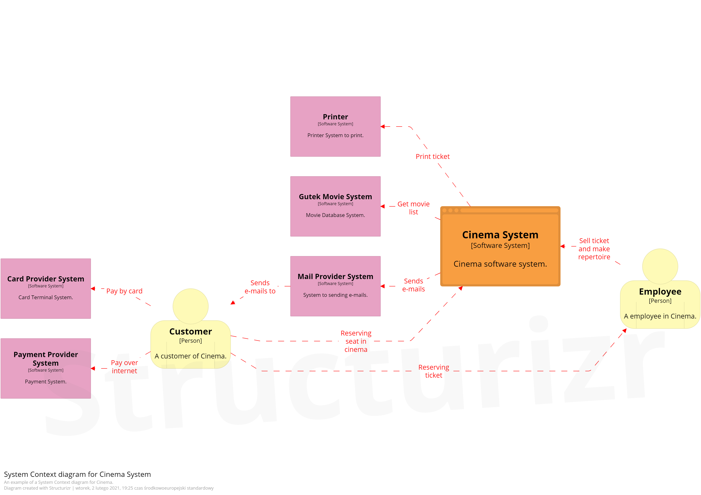

Sample **CINEMA** example of Model C4 in .NET Core with EventStorming.
==============================================================

## Give a Star! :star:
If you like this project, learn something, or are using it in your applications, please give it a star. Thanks!

## Model C4

Newsletter for this project in Polish: [ModelC4.pl](https://modelc4.pl)

## First step is a BigPicture, and C1 System Context
I used three first phases from EventStorming BigPicture to create a model of Cinema.

To create Model C4 diagrams I did not need a whole and detailed model with all events ;)

But after this step. I can saw some components for C1 System Context.
That's are Events as my Cinema Domain, Actors as Persons, and External Systems.

And now I can show the first layer of C4 Model.

Of course, the legend is necessary.

## Now is time to another level 2 which is C2 Container
At this level, I used BigPicture to determine inputs in the system, potential technologies, intentions, and protocols.

This information can be created on the brainstorm and write on events, notes, external systems, or other ES element.

By red dot, I marked important pieces of information.

